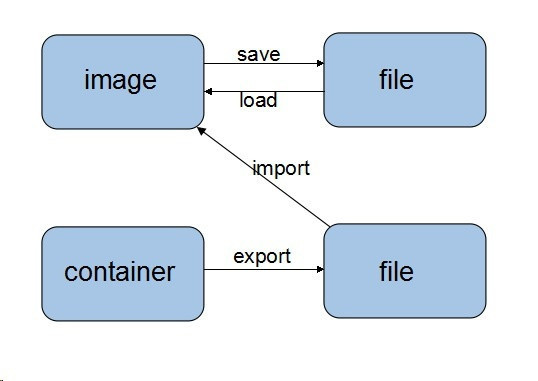

___docker基本操作笔记___

# 1. 基本概念
## Docker 中的三个概念：镜像，容器，仓库

1. 镜像（image）：Docker 镜像就是一个只读的模板，镜像可以用来创建 Docker 容器。Docker 提供了一个很简单的机制来创建镜像或者更新现有的镜像，用户甚至可以直接从其他人那里下载一个已经做好的镜像来直接使用。
镜像是一种文件结构。Dockerfile中的每条命令都会在文件系统中创建一个新的层次结构，文件系统在这些层次上构建起来，镜像就构建于这些联合的文件系统之上。Docker官方网站专门有一个页面来存储所有可用的镜像，网址是：index.docker.io。

2. 容器（ Container）：容器是从镜像创建的运行实例。它可以被启动、开始、停止、删除。每个容器都是相互隔离的、保证安全的平台。可以把容器看做是一个简易版的 Linux 环境，Docker 利用容器来运行应用。镜像是只读的，容器在启动的时候创建一层可写层作为最上层。

3. 仓库：仓库是集中存放镜像文件的场所，仓库注册服务器（Registry）上往往存放着多个仓库，每个仓库中又包含了多个镜像，每个镜像有不同的标签（tag）。目前，最大的公开仓库是 Docker Hub，存放了数量庞大的镜像供用户下载。


# 2. 安装
```shell
sudo apt-get install docker.io
```

# 3. 基本操作
```shell
su
#查看本地已有的镜像
docker images

#按关键字搜索网上的镜像
docker search XXX

#下载一个镜像到本地,这里的XXX/YYY是上述语句中获得的镜像 仓/名
docker pull XXX/YYY

#移除一个已有镜像
docker rmi XXX/YYY

#从本地仓另存一个镜像备份到本地（Image->File）
docker save XXX/YYY > /home/save.tar

#从当前一个容器保存到本地(Container->File)
docker export <容器ID or 容器名> > /home/export.tar

#从当前一个容器持久化为一个镜像(Container->Image)
docker commit <容器ID or 容器名> XXX/YYY

#从save得到的备份tar导入为一个镜像(File->Image)
docker load < save.tar

#从export得到的备份tar导入为一个镜像(File->Image)
cat export.tar |  docker import - XXX/YYY:v1.0

#查看所有已经建立的容器
docker ps -a

#启动、停止、重启、强制关闭一个容器
docker start <容器ID or 容器名>
docker stop <容器ID or 容器名>
docker restart <容器ID or 容器名>
docker kill <容器ID or 容器名>

#启动创建一个容器
docker run -it --name <容器名> -p 1111:8888 -v /home/user/xx:/yy XXX/YYY /bin/bash
#--name:为容器命名
#-v:使本地一个文件目录与容器中的一个路径共享统一目录数据
#-p:将容器中系统的一个端口映射为本地的一个端口

#重新登录一个正在执行的容器
docker attach <容器ID or 容器名>
```

_save/load ; export/import的关系_

